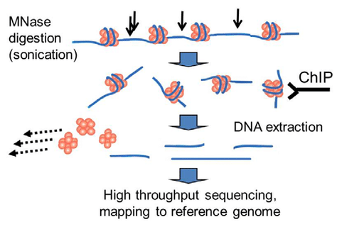
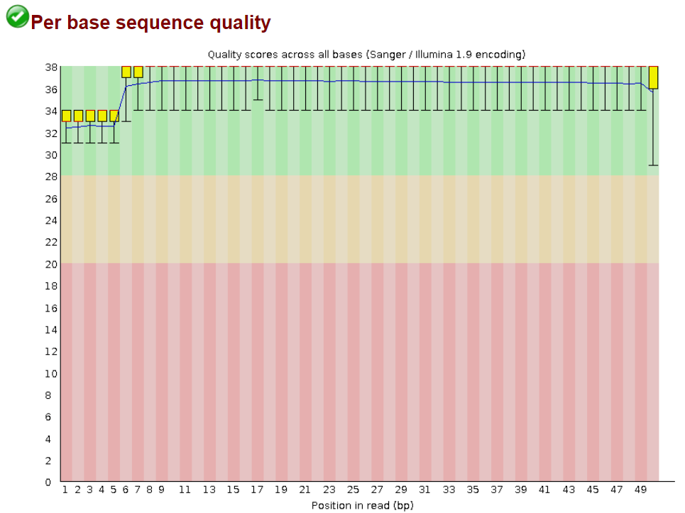

## ChIP-seq
<div align="justify">
This repository compiles a workflow designed for ChIP-seq data analysis. It includes a detailed description of the techniques and tools used, explores available alternatives, and provides examples of expected results.<br><br>

Chromatin immunoprecipitation (ChIP) experiments are performed to identify DNA bound to specific (chromatin) proteins of interest. The first step involves isolating the chromatin and immunoprecipitating (IP) fragements with an antibody against the protein of interest. In ChIP-seq, the immunoprecipitated DNA fragments are then sequenced, followed by identification of enriched regions of DNA or peaks. These peak calls can then be used to make biological inferences by determining the associated genomic features and/or over-represented sequence motifs.<br><br>


<br><br>


The first essential step in any biological data analysis is to perform a quality control check on the initial files. A widely used tool for this purpose is FastQC, although there are other alternatives, such as MultiQC or PRINSEQ.
```bash
$ fastqc reads.fastq
```
<br><br>

After running the quality control command, an HTML file containing the analysis results will be generated. The interpretation of these results is largely subjective. While the indicators provided can suggest whether the read quality is adequate, it is up to us to determine whether the file quality meets our requirements or if corrections are needed. If we choose the latter, the next step involves "trimming" the reads using tools such as Trimmomatic. This step is critical, as it removes low-quality reads, thereby improving the overall quality of the files and ensuring more reliable future results.

```bash
$ java -jar "directory/to/trimmomatic_jarfile"
       SE
       -threads "threads_number" \
       -phred33 "reads.fastq" \
       "trimmed_reads.fastq" \
       LEADING:
       TRAILING:
       SLIDINGWINDOW:
       MINLEN:
```
1. SE: Refers to a Single End analysis, where only one direction of the strand is analyzed. If both strands were used (Paired End), the PE option would be selected.
2. -threads: Specifies the number of threads used to execute the command. The higher the number of threads, the faster the execution. However, this depends on the performance of the computer being used.
3. -phred33: specifies the base quality encoding. In this case, it converts quality scores to Phred-33
4. LEADING: Cut bases off the start of a read, if below a threshold quality 
5. TRAILING: Cut bases off the end of a read, if below a threshold quality
6. SLIDINGWINDOW: Performs a sliding window trimming approach. It starts scanning at the 5‟ end and clips the read once the average quality within the window falls below a threshold.
7. MINLEN: Drop the read if it is below a specified length 

Once we are confident that our sequencing files have been processed as desired, we can proceed with aligning them to the reference genome. For this, the FASTA file is not used directly; instead, a prior indexing step is required. The genome indexing will vary depending on the alignment tool used. In this case, Bowtie2 is employed, although other options, such as HISAT2, are also available.
```bash
$ bowtie2-build reference_genome.fa index_prefix
```
```bash
$ bowtie2 -p 2
          -q
          -x ~/direcory/to/genome/index 
          -U ~/reads.fastq 
          -S ~/reads_mapped.sam
```
1. -p: launch NTHREADS parallel search threads
2. -q: reads (specified with m1, m2, s) are FASTQ files
3. -x: the basename of the index for the reference genome
4. -U: Comma-separated list of files containing unpaired reads to be aligned
5. -S: file to write SAM alignments to


The resulting file will be in SAM (Sequence Alignment/Map) format. While this type of file is easily readable by humans, it poses a significant challenge for the machine when processing it. For this reason, BAM formats exist, which are the binary version of SAM files. This allows for improved performance and efficiency when working with these files. Therefore, the first step after obtaining the alignment files is to convert them to BAM format. To do this, we will use the tool samtools, which is widely used in this type of analysis.

```bash
$ samtools view -h \
                -S \
                -b \
                -o /reads_mapped.bam /reads_mapped.sam
```
1. view: views and converts SAM/BAM/CRAM files
2. -h: include the header in the output
3. -S: input is in SAM format
4. -b: output in the BAM format
5. -o: output file

When obtaining BAM files, it is crucial to ensure they are both sorted and indexed to perform subsequent peak calling. Sambamba is a tool that allows these two steps to be executed simultaneously, optimizing the workflow. Alternatively, samtools can be used; however, this would require running two separate commands to sort and index the BAM files, respectively.<br><br>

Another important consideration is that when executing Bowtie2 for alignment, achieving 100% mapping is rare. Additionally, within the mapped regions, duplicates may be present. For accurate analysis, it is essential to remove both duplicates and unmapped regions, as they can skew the final results. Sambamba offers a specific option to address this issue effectively. In this repository, the two commands are shown separately, but they can be integrated using pipes for greater efficiency.

```bash
$ sambamba sort -t 2 \ 
                -o /reads_mapped.bam /reads_mapped_sorted.bam 
```
```bash
$ sambamba view -h \
                -t 2 \
                -f bam \ 
                -F "[XS] == null and not unmapped  and not duplicate" \ 
                reads_mapped_sorted.bam  > reads_mapped_sorted_aligned.bam 
```

Finally, once our BAM files have been properly processed, we can proceed with peak calling. The gold standard tool for ChIP-seq analysis is MACS2. This peak caller offers numerous options for conducting the analysis. There is no universal approach for all data analyses, as it depends on the type of data, its nature, quality, reference genome, and other factors. For this reason, the most effective strategy is to adjust these parameters, study the results, and compare the different outputs obtained.<br><br>
The principle behind peak callers lies in identifying regions enriched in IP samples compared to inputs. These regions are then compared across the different replicates being analyzed, discarding those that are not consistent across all of them. In this way, the enriched regions that are common to all samples reveal potential binding sites for a specific molecule to DNA.


```bash
$ macs2 callpeak -t bowtie2/H1hesc_Nanog_Rep1_aln.bam \
                 -c bowtie2/H1hesc_Input_Rep1_aln.bam \
                 -f BAM \
                 -g 12000000 \
                 -p 0.01
                 -n sample_name 
```

**Input file options**

* `-t`: The IP data file (this is the only REQUIRED parameter for MACS)
* `-c`: The control or mock data file
* `-f`: format of input file; Default is "AUTO" which will allow MACS to decide the format automatically.
* `-g`: mappable genome size which is defined as the genome size which can be sequenced; some precompiled values provided.

**Output arguments**

* `--outdir`: MACS2 will save all output files into speficied folder for this option
* `-n`: The prefix string for output files
* `-B/--bdg`: store the fragment pileup, control lambda, -log10pvalue and -log10qvalue scores in bedGraph files

**Shifting model arguments**

* `-s`: size of sequencing tags. Default, MACS will use the first 10 sequences from your input treatment file to determine it
* `--bw`: The bandwidth which is used to scan the genome ONLY for model building. Can be set to the expected sonication fragment size.
* `--mfold`: upper and lower limit for model building

**Peak calling arguments**

* `-q`: q-value (minimum FDR) cutoff
* `-p`: p-value cutoff (instead of q-value cutoff)
* `--nolambda`: do not consider the local bias/lambda at peak candidate regions
* `--broad`: broad peak calling

The execution of MACS2 will generate different types of files, some of which depend on the parameters considered during the MACS2 run.

* `_peaks.narrowPeak`: BED6+4 format file which contains the peak locations together with peak summit, pvalue and qvalue
* `_peaks.xls`: a tabular file which contains information about called peaks. Additional information includes pileup and fold enrichment
* `_summits.bed`: peak summits locations for every peak. To find the motifs at the binding sites, this file is recommended
* `_model.R`: an R script which you can use to produce a PDF image about the model based on your data and cross-correlation plot
* `_control_lambda.bdg`: bedGraph format for input sample
* `_treat_pileup.bdg`: bedGraph format for treatment sample

All these files will be generated for each peak calling result, so it is essential to consider the directory where they will be saved to ensure everything is well-organized.<br><br>

The next step in data analysis will require switching to the R programming language, which will be explained in detail in the "ChIP-seq_workflow_R" file.
</div>
