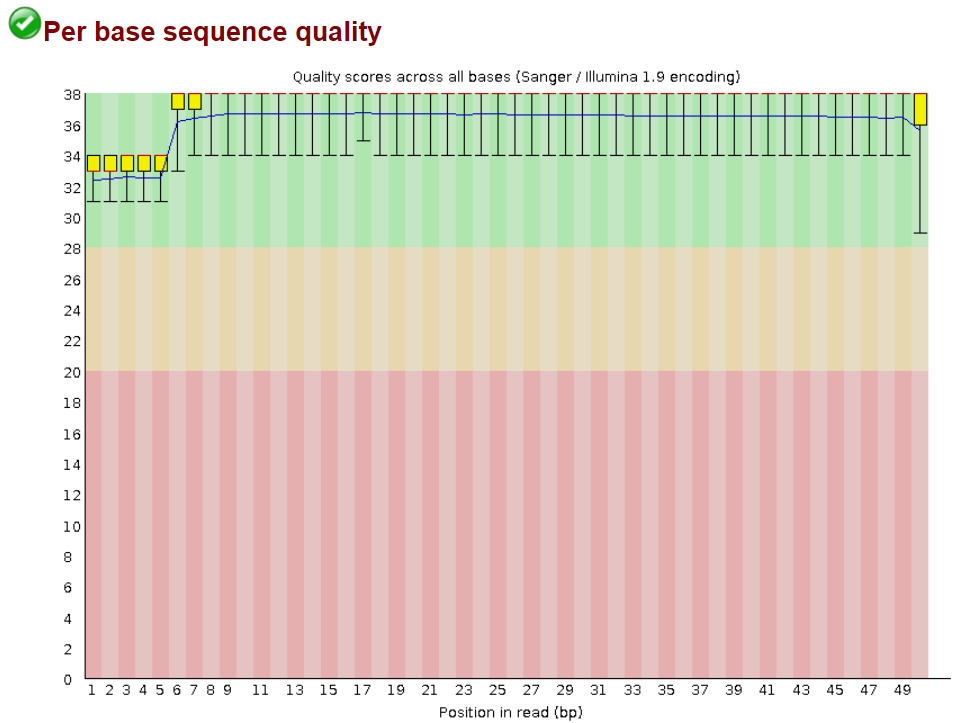

## ChIP-seq
<div align="justify">
This repository compiles a workflow designed for ChIP-seq data analysis. It includes a detailed description of the techniques and tools used, explores available alternatives, and provides examples of expected results.<br><br>

Chromatin immunoprecipitation (ChIP) experiments are performed to identify DNA bound to specific (chromatin) proteins of interest. The first step involves isolating the chromatin and immunoprecipitating (IP) fragements with an antibody against the protein of interest. In ChIP-seq, the immunoprecipitated DNA fragments are then sequenced, followed by identification of enriched regions of DNA or peaks. These peak calls can then be used to make biological inferences by determining the associated genomic features and/or over-represented sequence motifs.<br><br>


<br><br>


The first essential step in any biological data analysis is to perform a quality control check on the initial files. A widely used tool for this purpose is FastQC, although there are other alternatives, such as MultiQC or PRINSEQ.
```bash
$ fastqc reads.fastq
```
<br><br>

After running the quality control command, an HTML file containing the analysis results will be generated. The interpretation of these results is largely subjective. While the indicators provided can suggest whether the read quality is adequate, it is up to us to determine whether the file quality meets our requirements or if corrections are needed. If we choose the latter, the next step involves "trimming" the reads using tools such as Trimmomatic. This step is critical, as it removes low-quality reads, thereby improving the overall quality of the files and ensuring more reliable future results.

```bash
$ java -jar "directory/to/trimmomatic_jarfile"
       SE
       -threads "threads_number" \
       -phred33 "reads.fastq" \
       "trimmed_reads.fastq" \
       LEADING:
       TRAILING:
       SLIDINGWINDOW:
       MINLEN:
```
1. SE: Refers to a Single End analysis, where only one direction of the strand is analyzed. If both strands were used (Paired End), the PE option would be selected.
2. -threads: Specifies the number of threads used to execute the command. The higher the number of threads, the faster the execution. However, this depends on the performance of the computer being used.
3. -phred33: specifies the base quality encoding. In this case, it converts quality scores to Phred-33
4. LEADING: Cut bases off the start of a read, if below a threshold quality 
5. TRAILING: Cut bases off the end of a read, if below a threshold quality
6. SLIDINGWINDOW: Performs a sliding window trimming approach. It starts scanning at the 5‟ end and clips the read once the average quality within the window falls below a threshold.
7. MINLEN: Drop the read if it is below a specified length 

Once we are confident that our sequencing files have been processed as desired, we can proceed with aligning them to the reference genome. For this, the FASTA file is not used directly; instead, a prior indexing step is required. The genome indexing will vary depending on the alignment tool used. In this case, Bowtie2 is employed, although other options, such as HISAT2, are also available.
```bash
$ bowtie2-build reference_genome.fa index_prefix
```
```bash
$ bowtie2 -p 2
          -q
          -x ~/direcory/to/genome/index 
          -U ~/reads.fastq 
          -S ~/reads_mapped.sam
```
1. -p: launch NTHREADS parallel search threads
2. -q: reads (specified with m1, m2, s) are FASTQ files
3. -x: the basename of the index for the reference genome
4. -U: Comma-separated list of files containing unpaired reads to be aligned
5. -S: file to write SAM alignments to


The resulting file will be in SAM (Sequence Alignment/Map) format. While this type of file is easily readable by humans, it poses a significant challenge for the machine when processing it. For this reason, BAM formats exist, which are the binary version of SAM files. This allows for improved performance and efficiency when working with these files. Therefore, the first step after obtaining the alignment files is to convert them to BAM format. To do this, we will use the tool samtools, which is widely used in this type of analysis.

```bash
$ samtools view -h \
                -S \
                -b \
                -o /reads_mapped.bam /reads_mapped.sam
```
1. view: views and converts SAM/BAM/CRAM files
2. -h: include the header in the output
3. -S: input is in SAM format
4. -b: output in the BAM format
5. -o: output file

```bash
$ sambamba sort -t 2 \ 
                -o /reads_mapped.bam /reads_mapped_sorted.bam 
```

```bash
$ sambamba view -h \
                -t 2 \
                -f bam \ 
                -F "[XS] == null and not unmapped  and not duplicate" \ 
                reads_mapped_sorted.bam  > reads_mapped_sorted_aligned.bam 
```

```bash
$ macs2 callpeak -t bowtie2/H1hesc_Nanog_Rep1_aln.bam \
                 -c bowtie2/H1hesc_Input_Rep1_aln.bam \
                 -f BAM \
                 -g 12000000 \
                 -p 0.01
                 -n sample_name 
```

</div>
